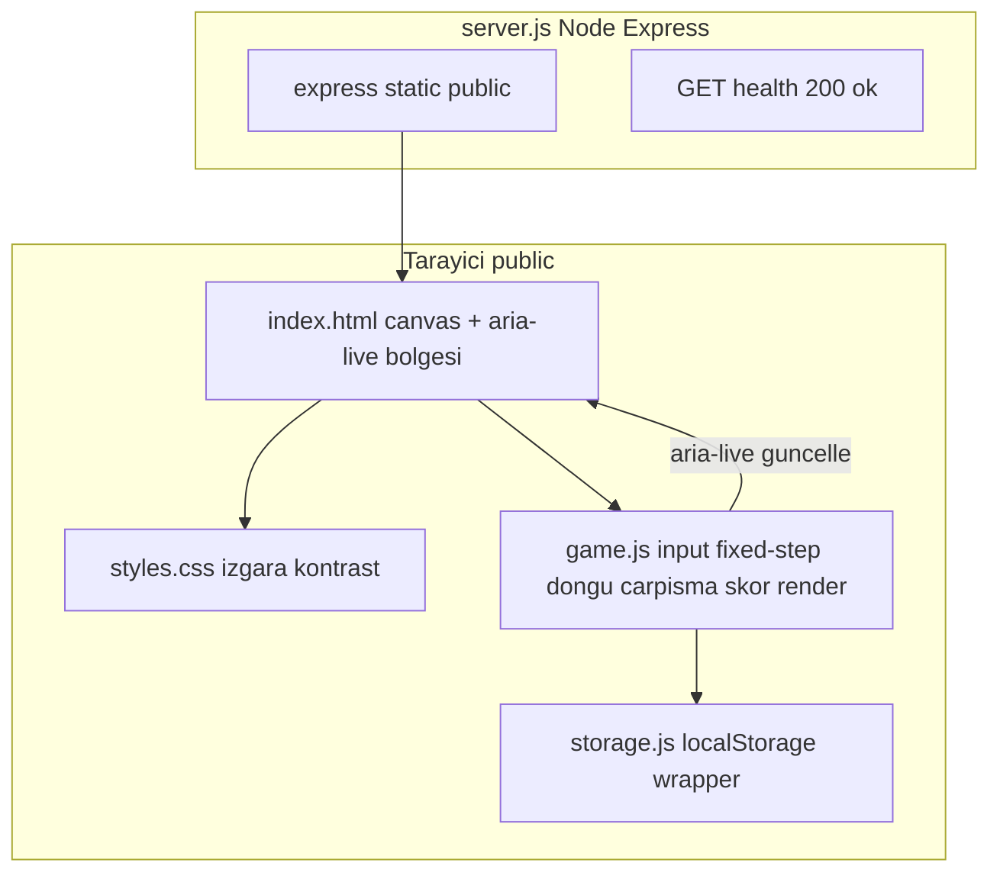
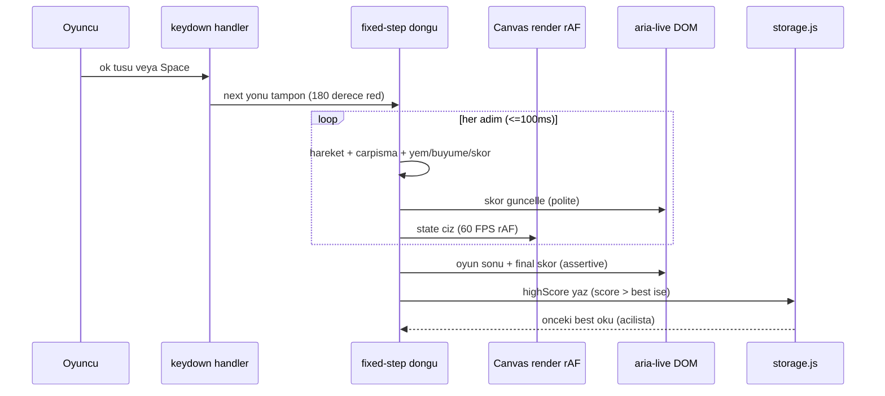

# 05 — Mimari Tasarım: snake-game

- Tarih: 2026-07-19 | Mod: AUTOPILOT | Profil: LITE
- Girdi: `docs/03-requirements.md`, `docs/04-solution-analysis.md`. Seçilen yığın (DL-04-001): Canvas+rAF render · minimal Express static · ince localStorage wrapper.

## Bileşen görünümü

Sınırlar: sunucu state'siz (yalnız statik + health); tüm oyun mantığı/kalıcılık istemcide. `game.js` içi katmanlar: input → fixed-step logic → render (Canvas) + aria-live köprüsü.

## Veri akışı


## Veri modeli
Tek istemci-içi `GameState` nesnesi (sunucuda kalıcı veri yok):
```
GameState = {
  grid:   { cols: 20, rows: 20, cell: 20 },   // hucre boyutu px
  snake:  [ {x,y}, ... ],   // hucre koordinatlari; index 0 = bas
  dir:    { x, y },         // aktif yon vektoru (ornek {1,0}=sag)
  next:   { x, y },         // keydown tamponu; sonraki adimda uygulanir
  food:   { x, y },         // yilan govdesi DISINDA rastgele hucre
  score:  0,               // yenen yem sayisi
  best:   0,               // storage.js'ten okunan en yuksek skor
  status: 'idle' | 'running' | 'gameover',
  stepMs: 100,             // mantik adimi araligi (NFR-1 <=100ms)
  acc:    0                // fixed-step accumulator (rAF delta birikimi)
}
```
Kalıcılık şeması (localStorage): anahtar `snake.highScore` → integer (string). `storage.js` `get()/set(n)` try/catch + `parseInt` doğrulaması ile sarar; NaN veya erişilemeyen depolamada `0`'a zarif düşer.

## Teknoloji seçimleri
| Katman | Seçim | Alternatifler | DL referansı |
|--------|-------|---------------|--------------|
| Render/oyun döngüsü | HTML5 Canvas 2D + requestAnimationFrame (fixed-step) | DOM/CSS-grid, SVG | DL-04-001, DL-05-001 |
| Servis katmanı | Node + Express + express.static + GET /health | bare Node http+fs | DL-04-001 |
| Skor kalıcılığı | ince localStorage wrapper (storage.js) | doğrudan localStorage API | DL-04-001 |
| İstemci dili | Vanilla JS (ES modules), framework yok | React/Vue vb. | DL-04-001 |
| Paketleme | node:alpine tek-katman Docker imajı | çok-aşamalı/tam node | DL-05-001 |

## NFR ↔ Mimari eşlemesi (kalite kapısı kanıtı)
| NFR | Mimarideki somut karşılığı |
|-----|-----------------------------|
| NFR-1 (giriş ≤100ms) | keydown → `next` tamponuna anında yazım (debounce yok); fixed-step `stepMs`≤100ms → yön en geç bir adımda uygulanır; render ayrık, girişi bloklamaz |
| NFR-2 (~60 FPS) | Canvas immediate-mode tek-yüzey redraw/rAF; fixed-step accumulator 60 FPS render'ı ~10 adım/s mantıktan ayırır → reflow/GC takılması yok |
| NFR-3 (asgari saldırı yüzeyi) | Sunucu yalnız `express.static` (path-traversal korumalı) + `/health`; DB/dosya yazımı=0; state tümüyle istemcide; CI `npm audit` Critical/High=0 |
| NFR-4 (HTTPS) | Deploy katmanı nginx + wildcard TLS (mevcut altyapı); uygulama kodu değişmez |
| NFR-5 (erişilebilirlik) | Canvas dışı ayrı DOM: skor `aria-live="polite"`, oyun-sonu+final skor `aria-live="assertive"`; %100 klavye (ok tuşları + Space/Enter başlat/yeniden); styles.css kontrast ≥4.5:1 (WCAG AA) |
| NFR-6 (tarayıcı uyumu) | Vanilla ES + Canvas 2D + rAF (evrensel destek); storage.js try/catch Safari özel-mod `setItem` throw'unda düşüş |
| NFR-7 (imaj ≤150MB) | node:alpine + tek bağımlılık (express); statik varlıklar birkaç KB → imaj ≪150MB, `docker build` ≪15dk |
| NFR-8 (/health %100) | Bağımsız `GET /health` → sabit 200 `{status:"ok"}`; harici bağımlılık yok |

## ADR listesi
- DL-04-001: Çözüm yığını seçimi (Canvas+rAF · Express static · localStorage wrapper) — Faz 4.
- DL-05-001: Fixed-step mantık döngüsünün 60 FPS rAF render'dan ayrılması + Canvas erişilebilirlik köprüsü (aria-live) + modül sınırları.

## Kalite kapısı raporu
- "Kritik NFR'lerin mimaride karşılığı var" → ✅ GEÇTİ — yukarıdaki NFR ↔ Mimari tablosu NFR-1..NFR-8'in HER BİRİNE somut mimari karşılık verir (özellikle NFR-1/2 fixed-step+rAF ayrımı, NFR-5 ayrı aria-live DOM katmanı, NFR-7 node:alpine tek-bağımlılık).
- Mermaid bileşen + veri akışı diyagramları mevcut; "## Veri modeli" `GameState` şekli + localStorage şeması tanımlı.
