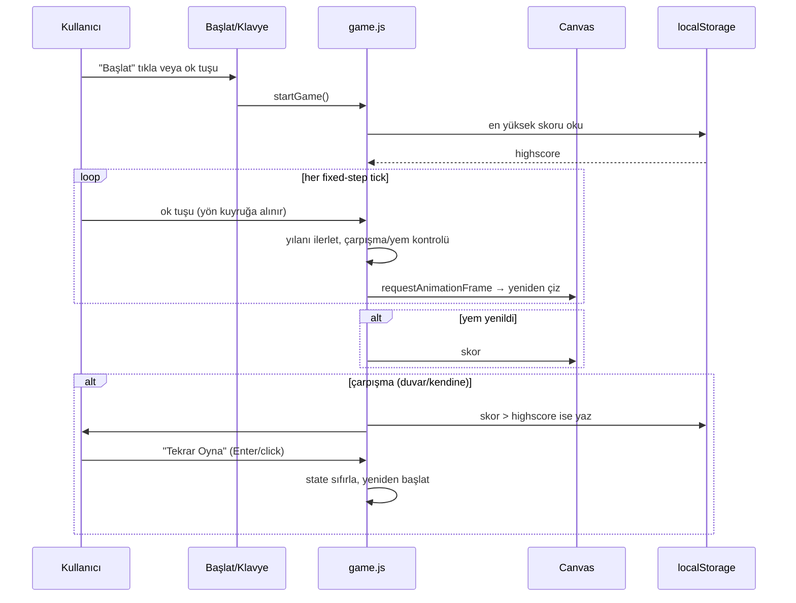

# 06 — UI/UX: snake-game

- Tarih: 2026-07-19 | Mod: AUTOPILOT | Profil: LITE
- Ürün tipi: web → tek sayfa (statik HTML + vanilla JS, Canvas render)

Girdi: `docs/03-requirements.md` (FR-1..7, NFR-1/2/5), `docs/05-architecture.md`.

## Yüzey sözleşmesi (tek ekran)
| Öğe | Rol | Etkileşim | İlgili FR/NFR |
|-----|-----|-----------|----------------|
| Başlık `<h1>` "🐍 Snake" | Sayfa kimliği | — | — |
| Oyun alanı `<canvas id="board">` | Izgara + yılan + yem çizimi | Ok tuşları ile yön değişir | FR-1, FR-2, FR-3, FR-4 |
| Skor `` | Güncel skor | Yem yenince güncellenir + duyurulur | FR-3, NFR-5 |
| En yüksek skor `` | `localStorage`'dan okunan rekor | Oyun bitince güncellenebilir | FR-5 |
| "Başlat" butonu `<button id="start">` | Oyunu başlat | Click / herhangi bir ok tuşu | FR-1 |
| Oyun sonu katmanı `
` | "Oyun Bitti" + final skor | Çarpışmada görünür, klavyeyle "Tekrar Oyna" | FR-4, FR-6, NFR-5 |

Yalnız klavye (ok tuşları + Enter/Space) — fare/dokunmatik zorunlu değil; ekstra kontrol (zorluk seçimi, çok oyunculu) YOK (FR-7).

## Ana akış — uçtan uca (kalite kapısı)

Klavye akışı: `Tab` ile "Başlat"a ulaş → `Enter`/ok tuşu ile başlat → oyun sırasında yalnız ok tuşları → oyun bitince `Tab`+`Enter` ile "Tekrar Oyna" (fare gerekmez, NFR-5).

## Çıktı/görsel şablonları
- **Başlangıç durumu:** Izgara görünür, yılan sabit 3 hücrelik başlangıç konumunda, skor 0, en yüksek skor `localStorage`'dan gösterilir, "Başlat" odaklı.
- **Oyun sırasında:** Yılan başı/gövdesi ve yem farklı renkte düz dolgu hücreler (minimal, doku/sprite yok — DL-03-001 varsayımı); skor üstte canlı güncellenir.
- **Oyun bitti katmanı:** Yarı saydam overlay, "Oyun Bitti — Skor: N" + "Tekrar Oyna" butonu; `aria-live="assertive"` ile anında duyurulur.
- **`prefers-reduced-motion`:** Oyun mantığı zaten adım-bazlı (rAF yalnız çizim) olduğundan ekstra "azaltılmış hareket" dalı gerekmez; ani/parlayan efekt kullanılmaz.
- **Hata/kenar durumları:** `localStorage` erişilemezse (özel mod/quota) skor kalıcılığı sessizce atlanır, oyun normal oynanır (DL-04-001 wrapper). JS devre dışıysa `<noscript>` "Bu oyun JavaScript gerektirir" mesajı gösterilir.

## Tasarım notları
- **Palet/kontrast:** Izgara arkaplanı koyu, yılan/yem yüksek kontrastlı düz renkler; metin/arka plan kontrastı ≥ 4.5:1 (WCAG 2.1 AA, NFR-5).
- **Boyut:** Kütüphanesiz vanilla JS+Canvas; toplam sayfa ≤ 150 KB hedefine rahat uyar (NFR-7 imaj bütçesiyle tutarlı).
- **Responsive:** Canvas sabit oranlı (20×20 ızgara), ≥360px mobil viewport'ta ortalanır; v1'de dokunmatik kontrol yok (FR-7), yalnız görüntüleme responsive'tir.
- **Ton:** Minimalist, retro-hissi olmayan düz-renk ızgara (DL-03-001 varsayımı) — coinflip/dice-game ile görsel tutarlılık.

## Kalite kapısı raporu
- "Ana kullanıcı akışları uçtan uca çizildi" → ✅ GEÇTİ — tek ana akış (başlat → oyna/tick → yem/çarpışma → oyun sonu → tekrar oyna) hem Mermaid hem metinsel klavye akışıyla uçtan uca verildi; başlangıç/oyun-sonu/localStorage-hata/JS-yok kenar durumları tanımlandı.
