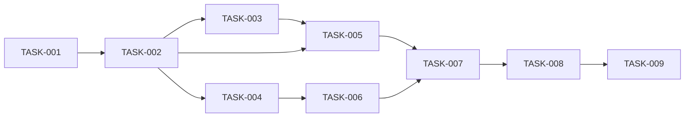

# 08 — Planlama: snake-game

- Tarih: 2026-07-19 | Mod: AUTOPILOT | Profil: LITE

## Milestone'lar
| M | Hedef | Kapsanan FR'ler | Hedef tarih |
|---|-------|-----------------|-------------|
| M1 | Oynanabilir v1 (tek milestone, LITE) | FR-1..7, NFR-1/2/5/8, SEC-1..8 | 2026-07-20 |

## Backlog (önceliklendirilmiş)

### [M1] TASK-001: Proje iskeleti + statik servis (`server.js`)
- **Tahmin:** 0.25 gün
- **Bağımlılık:** —
- **FR:** NFR-8 (health check)
- **Kabul:** `npm start` ile Express sunucusu ayağa kalkar; `GET /health` 200 döner; `public/` statik servis edilir.

### [M1] TASK-002: Canvas oyun döngüsü + yılan hareketi (fixed-step)
- **Tahmin:** 0.5 gün
- **Bağımlılık:** TASK-001
- **FR:** FR-1
- **Kabul:** Yılan sabit `stepMs` aralığında ızgarada ilerler; `requestAnimationFrame` ile Canvas'a çizilir.

### [M1] TASK-003: Klavye kontrolü (yön kuyruğu, 180° engeli)
- **Tahmin:** 0.25 gün
- **Bağımlılık:** TASK-002
- **FR:** FR-2
- **Kabul:** Ok tuşları yönü değiştirir (≤100ms); ters yöne (180°) dönüş yok sayılır.

### [M1] TASK-004: Yem üretimi, yeme, büyüme, skor
- **Tahmin:** 0.5 gün
- **Bağımlılık:** TASK-002
- **FR:** FR-3
- **Kabul:** Yem yılan gövdesi dışında rastgele belirir; yenince yılan uzar, skor 1 artar ve ekranda güncellenir.

### [M1] TASK-005: Çarpışma tespiti + oyun sonu ekranı
- **Tahmin:** 0.5 gün
- **Bağımlılık:** TASK-002, TASK-003
- **FR:** FR-4
- **Kabul:** Duvar/kendine çarpışmada döngü durur, "Oyun Bitti" + final skor gösterilir ve `aria-live` ile duyurulur.

### [M1] TASK-006: `localStorage` wrapper + en yüksek skor kalıcılığı
- **Tahmin:** 0.25 gün
- **Bağımlılık:** TASK-004
- **FR:** FR-5
- **Kabul:** Oyun bitiminde skor eskisinden büyükse kaydedilir; sayfa yenilenince doğru okunur; storage erişilemezse sessizce atlanır.

### [M1] TASK-007: Yeniden başlatma akışı
- **Tahmin:** 0.25 gün
- **Bağımlılık:** TASK-005, TASK-006
- **FR:** FR-6
- **Kabul:** "Tekrar Oyna" ile state sıfırlanır, skor 0'a döner, en yüksek skor korunur.

### [M1] TASK-008: Erişilebilirlik + güvenlik sertleştirme
- **Tahmin:** 0.5 gün
- **Bağımlılık:** TASK-007
- **FR:** NFR-5, SEC-1..8 (bkz. `docs/07-security.md`)
- **Kabul:** Güvenlik başlıkları+CSP eklendi, `express.static` kilitli, klavyeyle %100 kullanılabilir, kontrast ≥4.5:1, `npm audit` Critical/High=0.

### [M1] TASK-009: Test paketi (TDD, birim + entegrasyon)
- **Tahmin:** 0.5 gün
- **Bağımlılık:** TASK-008
- **FR:** FR-1..7 kritik senaryoları
- **Kabul:** `npm test` yeşil, coverage ≥%70; her task için önce test (red) sonra implementasyon (green) commit çifti.

## Bağımlılık grafı (kalite kapısı: çevrimsiz)

## Kalite kapısı raporu
- "Her task 1 günden küçük" → ✅ GEÇTİ (9 task, hepsi ≤0.5 gün).
- "Bağımlılık grafı çevrimsiz" → ✅ GEÇTİ (yukarıdaki graf tek yönlü, döngü yok — TASK-001'den TASK-009'a doğrusal+dallanan ilerleme).
